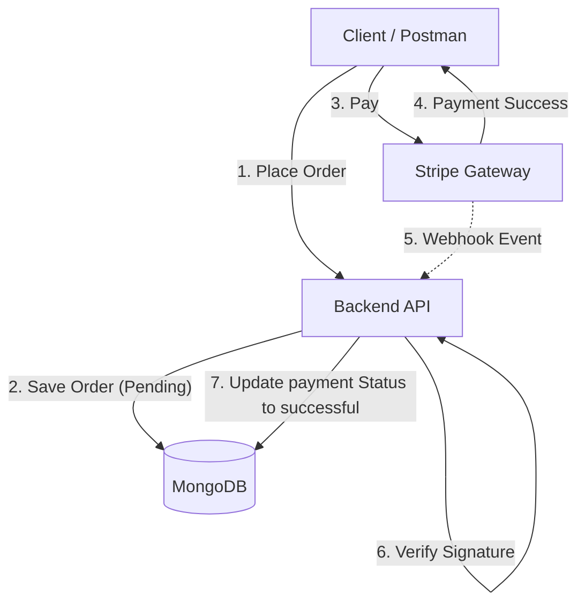

# 🛒 Nexus E-Commerce API (Backend)

    

> A production-grade, scalable RESTful API built for modern e-commerce platforms. Features robust security, Role-Based Access Control (RBAC), and an asynchronous event-driven payment architecture using Stripe Webhooks.

---
## Note: The server is hosted on a free tier service (Render). Please allow 30-50 seconds for the initial request to wake up the server.
## 🚀 Live Demonstration

* **🌐 Live Server (Render):** [ INSERT_YOUR_RENDER_URL_HERE ]
* **📄 API Documentation (Postman):** [ INSERT_YOUR_POSTMAN_PUBLIC_LINK_HERE ]

---

## 🏛️ Architecture: The MVC Pattern

This project strictly follows the **Model-View-Controller (MVC)** architecture to ensure "Separation of Concerns" and code scalability.

* **📂 Models:** Defined using **Mongoose** schemas with strict validation to ensure data consistency.
* **🎮 Controllers:** Handles the core business logic (Order processing, Payment initiation), distinct from the routing layer.
* **🛣️ Routes:** Manages API endpoints and maps them to respective controllers.
* **🛡️ Middlewares:** Acts as the gatekeepers for Authentication, Authorization (RBAC), and Error Handling.

---

## 🛠️ Complete Tech Stack & Libraries

I have carefully selected the following libraries to build a secure and efficient backend:

### **Core Framework**
* **Node.js & Express.js:** For building a high-performance, non-blocking REST API.
* **Mongoose:** For elegant MongoDB object modeling and schema validation.
* **Dotenv:** For managing environment variables and sensitive keys securely.

### **🔐 Security & Authentication**
* **Bcrypt.js:** Used for **Salting and Hashing** passwords. We never store plain-text passwords in the DB.
* **JSON Web Tokens (JWT):** For stateless, secure user authentication via Bearer Tokens.
* **Express-Rate-Limiter:** Prevents Brute-Force and DDoS attacks by limiting repeated requests from the same IP address.
* **CORS:** Configured to allow secure cross-origin resource sharing.

### **💳 Payments & Logic**
* **Stripe SDK:** Handles Payment Intents and Webhook event construction.
* **Body-Parser:** Specifically used to handle raw streams for Stripe Webhook signature verification.


## ✨ Key Features & Business Logic

### 1. 📦 Advanced Order Management (Order-First Flow)
* **Optimistic Ordering:** Orders are created with a `Pending` status *before* payment. This ensures that if a payment fails or the user drops off, the cart data is preserved as an order attempt.
* **Inventory Locking:** Stock is reserved immediately upon order creation to prevent "Race Conditions" (e.g., two users buying the last item simultaneously).
* **Cancellation Policy:** The Logic let users cancel their order, only then if it is not shipped yet.

### 2. 💳 Real-Time Payments (Stripe)
* **Secure Webhooks:** The system listens for `payment_intent.succeeded` events directly from Stripe servers.
* **Automatic Reconciliation:** The database status updates from `Pending` -> `Successful` automatically when the bank clears the transaction.
* **Failure Handling:** Listens for `payment_intent.payment_failed` to log failures and update order status accordingly.

### 3. 🔐 Role-Based Access Control (RBAC)
Granular permission levels implemented via custom middleware:
* **👑 Admin:** Complete system control. Can manage all Users, Products, and view global Order History.
* **👤 User:** Standard e-commerce features (Browse, Add to Cart, Checkout, View Own Orders).
* **🏗️ Scalable Architecture:** The RBAC system is pre-configured to easily onboard new roles (like Sellers/Moderators) in future updates.

### 4. 🚀 Performance & Scalability
* **Cursor-Based Pagination:** Implemented efficient cursor-based pagination for product listings instead of traditional `skip/limit`.
    * **Benefit:** Ensures **O(1) read performance** regardless of database size (millions of records).
    * **Use Case:** Perfect for "Infinite Scroll" features on the frontend, eliminating data drift (duplicate/missing items) when new products are added in real-time.
  
---


## ⚙️ Local Installation & Setup

### 1. Clone the Repository
```bash
git clone https://github.com/VAISHNAV9891/EcommerceAPI.git
cd EcommerceAPI
```
### 2. Install Dependencies
```bash
npm install
```

### 3. Environment Variables
Create a .env file in the root directory:

Code snippet :

```bash
PORT=5000
NODE_ENV=development
MONGO_URL=your_mongodb_connection_string

# Auth Secrets
JWT_SECRET_KEY=your_complex_secret_key
JWT_EXPIRES_IN=2h

# Stripe Configuration
STRIPE_SECRET_KEY=sk_test_...
STRIPE_WEBHOOK_SECRET=whsec_...
```


4. Start the Server

```bash
# Run in development mode (with Nodemon)
npm run dev
```

## 🧪 Testing Credentials 

To facilitate quick testing of the features, use these pre-configured accounts:

| Role | Email | Password | Access Capabilities |
| :--- | :--- | :--- | :--- |
| **Admin** | `admin@demo.com` | `admin123` | Create Products, View All Orders, Update order status, delete Reviews |
| **User** | `user@demo.com` | `user123` | Shop, Add to Cart, Checkout, Cancel Orders until shipping |

## 📡 API Endpoints Snapshot

**Note:** Below is a highlight of the key features. For the full list of **20+ endpoints** (including Admin controls , fetching orders etc), please refer to the [**Postman Documentation**]( INSERT_POSTMAN_LINK_HERE ).

| Module | Method | Endpoint | Description | Access |
| :--- | :--- | :--- | :--- | :--- |
| **Auth** | `POST` | `/api/users/signup` | Register a new user | Public |
| | `POST` | `/api/users/login` | Login & generate JWT | Public |
| **Cart** | `POST` | `/api/cart/myCart` | Add item to cart | **User** |
| **Orders** | `POST` | `/api/orders` | Place a new order | **User** |
| **Reviews** | `POST` | `/api/reviews` | Add a product review | **User** |
| **Payment** | `POST` | `/api/payment/createPaymentEnv` | Initiate Stripe Payment | **User** |
| | `POST` | `/api/webhook` | Stripe Event Listener(webhook handling) | **Stripe** |


## 🏗️ System Flow Diagram
 
This diagram illustrates the **Order-First Architecture** used to ensure data integrity during the payment process.


## 🔮 Future Improvements (Roadmap)

While the current V1 focuses on core commerce and payment logic, here is the roadmap for upcoming features:

* [ ] **User Profile Management:** Allow users to update profile details and manage addresses.
* [ ] **Cloudinary Integration:** Replace image URL strings with actual file uploads via Multer.
* [ ] **Admin Dashboard:** Build a React-based frontend for visual inventory management.
* [ ] **Redis Caching:** Implement caching for the required endpoints to reduce database load.
* [ ] **Email Notifications:** Integrate Nodemailer to send order confirmation emails.

## 👨‍💻 Author
**Vaishnav Khanna**

---


If you found this API architecture useful or learned something new, please consider giving the repository a **Star** ⭐️.


